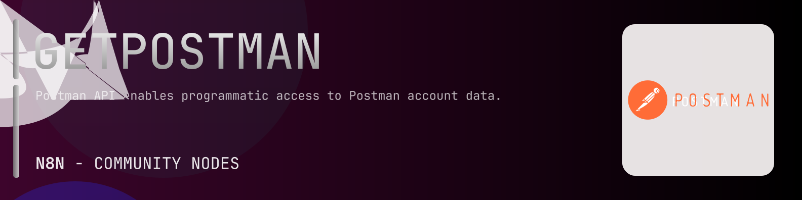

# @n8n-dev/n8n-nodes-getpostman



[](https://www.npmjs.com/package/@n8n-dev/n8n-nodes-getpostman)
[](https://opensource.org/licenses/MIT)

---

**Stop writing getpostman API integrations by hand.**

Every time you connect n8n to getpostman, you waste hours mapping endpoints, defining parameters, and debugging schemas. You copy-paste from docs, fix edge cases, and pray nothing breaks.

**What if connecting n8n to getpostman took 5 minutes, not half a day?**

This node gives you **12+ resources** out of the box: **Collections**, **Environments**, **Mocks**, **Monitors**, **Workspaces**, and 7 more: with full CRUD operations, typed parameters, and zero manual configuration.

---

## What You Get

- **Zero boilerplate**: Resources, operations, and fields are pre-configured and ready to use
- **Full CRUD**: Create, read, update, and delete support where the API allows it
- **Typed parameters**: No more guessing field types
- **Built-in auth**: API key authentication, ready to go
- **Declarative**: Native n8n performance, no custom execute() overhead

---

## Install

```bash
npm install @n8n-dev/n8n-nodes-getpostman
```

**Or in n8n:**
1. **Settings → Community Nodes → Install**
2. Search: `@n8n-dev/n8n-nodes-getpostman`
3. Click **Install**

---

## Quick Start

1. Install the node (above)
2. Add credentials: **getpostman API** → paste your API key
3. Drag the **getpostman** node into your workflow
4. Pick a resource → pick an operation → done.

That's it. No configuration files. No code. It just works.

---

## Resources

<details>
<summary><b>Collections</b> (7 operations)</summary>

- Get All Collections
- Post Create Collection
- Post Create a Fork
- Post Merge a Fork
- Delete Collection
- Get Single Collection
- Put Update Collection

</details>

<details>
<summary><b>Environments</b> (5 operations)</summary>

- Get All Environments
- Post Create Environment
- Delete Environment
- Get Single Environment
- Put Update Environment

</details>

<details>
<summary><b>Mocks</b> (7 operations)</summary>

- Get All Mocks
- Post Create Mock
- Delete Mock
- Get Single Mock
- Put Update Mock
- Post Publish Mock
- Delete Unpublish Mock

</details>

<details>
<summary><b>Monitors</b> (6 operations)</summary>

- Get All Monitors
- Post Create Monitor
- Delete Monitor
- Get Single Monitor
- Put Update Monitor
- Post Run a Monitor

</details>

<details>
<summary><b>Workspaces</b> (5 operations)</summary>

- Get All workspaces
- Post Create Workspace
- Delete Workspace
- Get Single workspace
- Put Update Workspace

</details>

<details>
<summary><b>User</b> (1 operations)</summary>

- Get API Key Owner

</details>

<details>
<summary><b>Import</b> (2 operations)</summary>

- Post Import exported data
- Post Import external API specification

</details>

<details>
<summary><b>API</b> (23 operations)</summary>

- Get all APIs
- Post Create API
- Delete an API
- Get Single API
- Put Update an API
- Get All API Versions
- Post Create API Version
- Delete an API Version
- Get an API Version
- Put Update an API Version
- Get contract test relations
- Get documentation relations
- Get environment relations
- Get integration test relations
- Get monitor relations
- Get linked relations
- Post Create relations
- Post Create Schema
- Get Schema
- Put Update Schema
- Post Create collection from schema
- Get test suite relations
- Put Sync relations with schema

</details>

<details>
<summary><b>API Version</b> (5 operations)</summary>

- Get All API Versions
- Post Create API Version
- Delete an API Version
- Get an API Version
- Put Update an API Version

</details>

<details>
<summary><b>Schema</b> (4 operations)</summary>

- Post Create Schema
- Get Schema
- Put Update Schema
- Post Create collection from schema

</details>

<details>
<summary><b>Relations</b> (9 operations)</summary>

- Get contract test relations
- Get documentation relations
- Get environment relations
- Get integration test relations
- Get monitor relations
- Get linked relations
- Post Create relations
- Get test suite relations
- Put Sync relations with schema

</details>

<details>
<summary><b>Webhooks</b> (1 operations)</summary>

- Post Create WEBHOOK

</details>

---

## Why This Node?

**Without this node:**
- Hours of manual API integration
- Copy-pasting from getpostman docs
- Debugging auth, pagination, error handling
- Maintaining your own client code

**With this node:**
- Install → configure → use. 5 minutes.
- Auto-generated from the official getpostman OpenAPI spec
- Always up to date when the API changes
- Native n8n performance

---

## Auto-Generated
This node was auto-generated from the official **getpostman** OpenAPI specification using
[@n8n-dev/n8n-openapi-node-ultimate](https://github.com/kelvinzer0/n8n-openapi-node-ultimate),
then validated against the live API so you get accurate types and real parameters, not guesswork.

When the getpostman API updates, this node updates too.

---


## License

MIT © [kelvinzer0](https://github.com/n8n-code)
